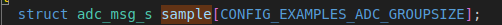
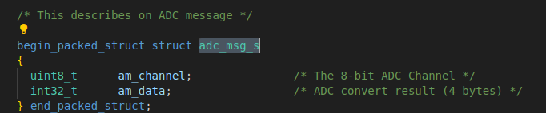

#       adc_main.c  参考文件
文件路径    apps/examples/adc/adc_main.c

##      main函数解析 
###     1.  adc结构体设置
1.  是否初始化
2.  adc 设备路径设置
3.  adc 采样组数
4.  adc 每组采样频率一开始就设置了

###     2.  参数解析

###     3.  open -> read   这个流程还是老样子 但是这个read函数要注意
nbytes = read(fd, sample, readsize);
1.  sample是结构体数组，用来存放读取的结果，用一个32位的变量来记录（4字节）（结构体同时也记录adc通道）

2.  readsize 是读取的全部次数  
3.  nbytes  是实际读取的字节

###     这个结构体要特别说一下，这是一个采样的样本数据存放的结构体。 每次采样的数据会包括一个通道号和四字节的数据，所以一共五字节 

