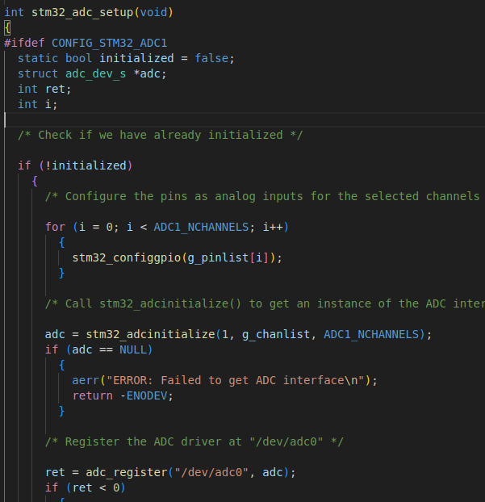
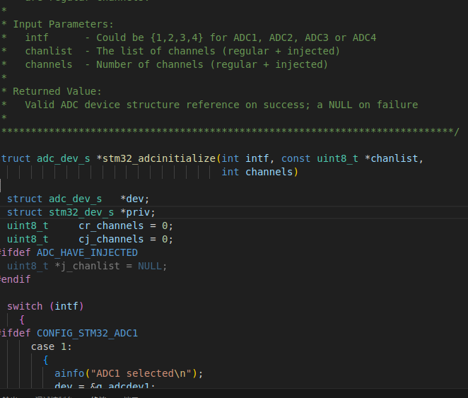

#       两套流程
##      用户角度:  从上至下
从用户视角，是poisx层统一的操作函数 open\read\write\ioctl  ，一级级的往下调用   （函数调用的过程）
1.  app ->  driver  ->  boards  ->  arch
2.  用户层    ->    驱动层  ->  bsp ->  芯片层（hal）
##      内核角度：  从下至上
从内核视角，bsp配置好要用的一切，然后向内核注册，   下面是函数调用过程
1.  bsp ->  hal
2.  boards  ->  arch

#       hal层解析   stm32_adc.c
文件路径    boards/arm/stm32/stm32f103-minimum/src/stm32_adc.c

##      代码量很少  只有一个函数    int stm32_adc_setup(void)； 用来配置引脚和注册设备，stm32_adc_setup同样会被stm32bringup函数调用
1.  stm32_configgpio 和 stm32_adcinitialize 配置引脚功能
2.  ret = adc_register("/dev/adc0", adc);   把设备名和返回的设备结构体注册到一起 

###     adc = stm32_adcinitialize(1, g_chanlist, ADC1_NCHANNELS);

1.  配置引脚函数，定义于  /home/kingadam/code/nuttxspace/nuttx/arch/arm/src/stm32/stm32_adc.c
2.  返回值注意，这是一个adc的设备结构体  对于上层驱动如何控制adc，关键是这个结构体
3.  参数看图，很简单不额外解释
###     ret = adc_register("/dev/adc0", adc);
1.  把设备名 和 上面返回的设备结构体（adc）注册到一起 
2.  这个函数定义于上层的驱动，这样就把bsp和通用的上层驱动联系起来了

#       poisx驱动层解析

##      int adc_register(FAR const char *path, FAR struct adc_dev_s *dev)；

##      函数	位置	作用
1.  adc_poll()	上层驱动（adc.c）	当用户调用 poll()（或 select()）时注册监听事件
2.  adc_notify()	下层驱动回调上层	下层驱动通知上层 “有新数据来了”
3.  两者是配对使用的，用于 实现 poll/select 异步 I/O 机制。
###     adc_poll()函数 —— 注册监听事件
###     adc_notify() —— 数据到达时通知用户线程
