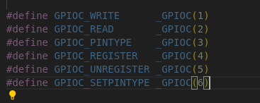
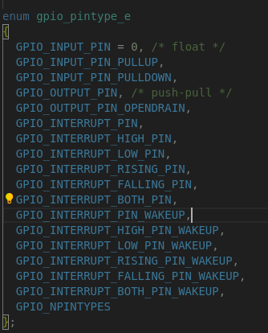

#       gpio_main.c 参考文件路径
文件路径    apps/examples/gpio/gpio_main.c
##      这个文件还是写的太复杂了（毕竟是作为示例），但是该有的全部展现出来了  以下是自己的写法和解析

##      第一步：参数解析    第二步：open->fd    第三步：    通过给ioctl来操作引脚

##      只有 ioctl 这一个函数需要理解，其主要是依靠传递宏来实现不同功能。

###     ioctl(fd, GPIOC_SETPINTYPE, (unsigned long) newpintype);

###     第一个参数fd是文件描述符（  fd = open(devpath, O_RDWR);） 第二个参数是宏（主要的功能实现）第三个参数需要根据宏来传入（变量或指针）

这些宏定义于 nuttx/include/nuttx/ioexpander/gpio.h 文件中

###     GPIOC_SETPINTYPE 这个宏需要注意，因为设置引脚类型也需要传入特定的宏，同样定义于上面的文件中

##      注册中断信号通知    这个也很有意思 暂时不用

###     sigtimedwait 类似于poll和select 是让出cpu的
####    1. 程序调用后会挂起当前线程
####    2. 内核会把这个线程挂到信号等待队列里
####    3. 在等待期间，CPU 是让出来的
####    4. 如果在超时时间内收到信号，就立即唤醒继续执行
####    5. 如果超时没收到信号，就返回 -1 并设置 errno = EAGAIN

###     使用方法
####    1.设置一个结构体变量    sigevent notify

####    2.把结构体使用ioctl函数传入