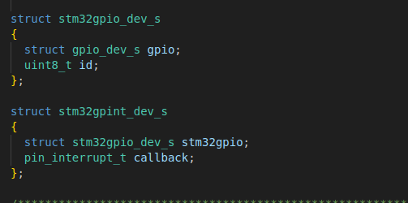
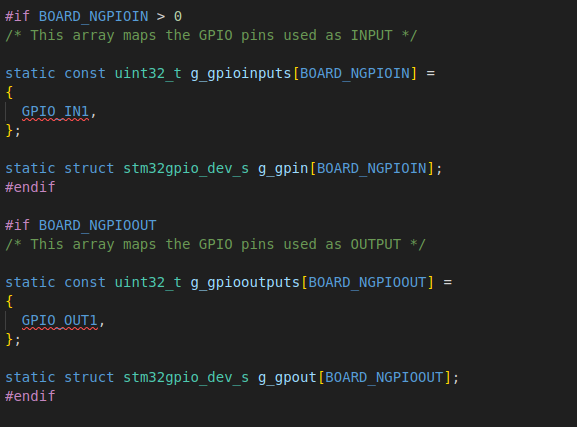
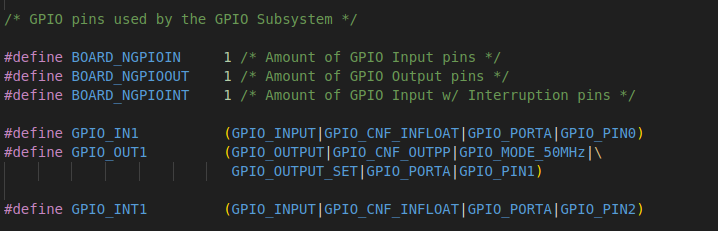
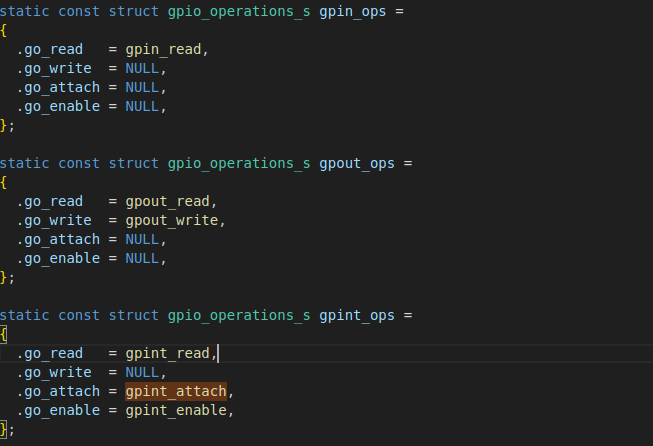
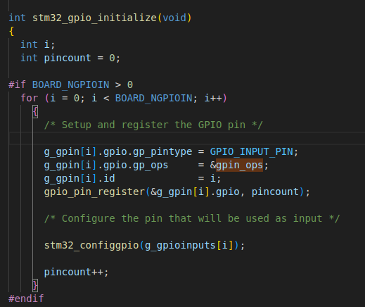

#       一、BSP层   stm32_gpio.c
文件路径    /home/kingadam/code/nuttxspace/nuttx/boards/arm/stm32/stm32f103-minimum/src/stm32_gpio.c

##      逻辑 很简单 
###     1. 定义数据结构体和资源数组（数组值定义于 boards/arm/stm32/stm32f103-minimum/src/stm32f103_minimum.h）

###     2.  然后老套路  设置operation结构体  
要注意这里的结构体还只是 gpio_operations_s  还不是  file_operations  这点要注意

###     3.  初始化函数  int stm32_gpio_initialize(void)；
####    3.1 根据 定义在头文件的宏 和 上面的引脚资源数组 来设置 引脚结构体数组
####    3.2 然后把 引脚结构体 和 对应的 opr结构体 一起进行注册         注册函数   gpio_pin_register(&g_gpin[i].gpio, pincount);
####    3.3 然后根据定义的引脚宏 使用 stm32_configgpio(g_gpioinputs[i]); 来配置引脚

##      总结      
###     实际流程       1.资源定义于头文件 -> 2.使用数组进行资源管理 -> 3.初始化函数中把资源配置到结构体并进行注册

###     stm32_gpio_initialize 函数也是被 stm32bringup.c 文件的 stm32bringup 函数调用来初始化

#       二、HAL层   gpio.c
文件路径    /home/kingadam/code/nuttxspace/nuttx/drivers/ioexpander/gpio.c
##      这层的逻辑就非常简单了，完全和linux驱动层一样 这样就提供了统一的posix接口

#       这个函数要注意 gpio_pin_register  枢纽
##      gpio_pin_register(); -> gpio_pin_register() -> gpio_pin_register_byname(); -> register_driver();
##      gpio_pin_register()是Hal层函数 ，由此bsp和hal建立关系  