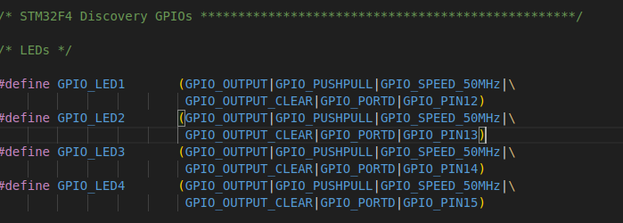

#      通过kconfig系统可以对庞大的源码进行配置，通过deconfig文件的开关选择想要的文件
#      CMakeLists.txt文件会根据kconfig系统配置出来的.config文件（里面是一堆宏）根据这堆宏来选择是否把某些文件加入编译

#      hal驱动层   参考stm32_userleds.c 
文件路径    /home/kingadam/temp/nuttxspace/nuttx/boards/arm/stm32/stm32f4discovery/src/stm32_userleds.c

##     一、主要是两个函数和一个数组  led初始化函数 设置led函数 和 一个资源数组
static uint32_t g_ledcfg[BOARD_NLEDS] =
{
  GPIO_LED1, GPIO_LED2, GPIO_LED3, GPIO_LED4
};
该数组的值被定义于/home/kingadam/temp/nuttxspace/nuttx/boards/arm/stm32/stm32f4discovery/src/stm32f4discovery.h

###     1.  g_ledcfg[BOARD_NLEDS] 数组主要的作用是将被定义好的引脚集合，方便调用
####    1.1 引脚定义  #define GPIO_LED1       (GPIO_OUTPUT|GPIO_PUSHPULL|GPIO_SPEED_50MHz|\GPIO_OUTPUT_CLEAR|GPIO_PORTD|GPIO_PIN12)
可以看到 GPIO_LED1 是一个uint32_t变量，是由一堆配置的值 | 出来的（输出模式、上拉、50mhz、d12引脚    GPIO_OUTPUT_CLEAR这个应该是清除某些寄存器的值）
   

###     2.  uint32_t board_userled_initialize(void)；
####    2.1 使用stm32_configgpio(GPIO_LED1);根据GPIO_LED1的值对某个gpio口进行初始化配置

###     3.  void board_userled(int led, bool ledon)；
####    3.1 根据传入的参数，使用stm32_gpiowrite(g_ledcfg[led], ledon);对io口设置指定的值

##      二、在hal层，只需要在tm32f4discovery.h 更改 GPIO_LED1 的定义 就可以做到使用别的引脚

##      hal层隐藏了硬件的细节、向上提供使用接口（函数）和资源（数组）//也没有完全隐藏
##      函数声明于#include <nuttx/board.h>  通过这个文件 上层的userled_lower.c可以调用该层函数  
文件路径  /home/kingadam/temp/nuttxspace/nuttx/include/nuttx/board.h

#     posix驱动层   参考userled_upper.c 和 userled_lower.c
文件路径    /home/kingadam/temp/nuttxspace/nuttx/drivers/leds/userled_upper.c   /home/kingadam/temp/nuttxspace/nuttx/drivers/leds/userled_lower.c
##    在nuttx中这层的驱动分为上下层两部分  分成两部分，主要是先用下层来承接bsp，上层是个性化承接用户空间

##    三、userled_upper.c分析
###   struct userled_upperhalf_s  结构体分析

####  lu_lower：指向下层驱动接口的指针，用于调用下层驱动的函数，如设置 LED 状态等。
####  lu_supported：记录支持的 LED 集合，通过下层驱动的ll_supported获取。
####  lu_ledset：当前所有 LED 的状态，以位掩码表示。
####  lu_lock：互斥锁，用于多线程环境下的互斥访问，确保设备操作的原子性。
####  lu_open：指向打开该设备的引用链表，管理多个打开设备的实例。

##    四、集成文件  参考CMakeLists.txt
文件路径  /home/kingadam/temp/nuttxspace/nuttx/boards/arm/stm32/stm32f4discovery/src/CMakeLists.txt
###   set(SRCS stm32_boot.c stm32_bringup.c stm32_spi.c)
首先包含这三个基础文件
####  stm32_bringup.c 
这个文件的作用就是把驱动汇总到一起，里面会根据宏来选择函数是否被使用
####  stm32_boot.c
更进一步，把stm32_bringup函数向上注册到board_late_initialize函数
这个函数就是系统自动调用了

###   注册流程
stm32_boot.c中使用 board_late_initialize 函数 调用到stm32_bringup.c中的 stm32_bringup 函数 
在 stm32_bringup 中继承了所有驱动的初始化函数，如 userled_lower_initialize 这个函数定义于 userled_lower.c 会调用上层的函数（位于userled_upper.c）进行fileoperation等注册，也会向下调用BSP层（这个就是在boards文件夹下）的硬件相关函数
####  userled_upper.c 和 userled_lower.c 两个文件合并在一起才是一个完整的led驱动 ，我认为完全可以合并在一起