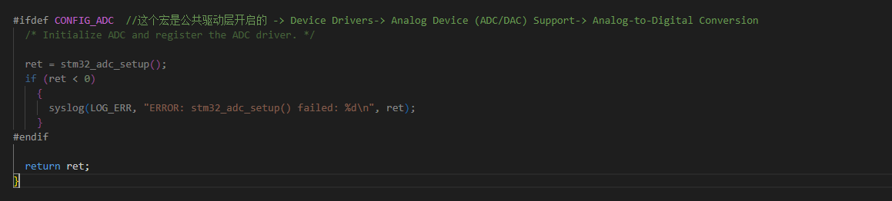
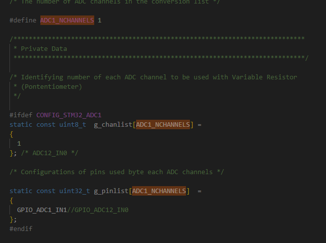

#   mythread应用层
#   驱动层需要添加bsp
##  adc的bsp ，参考stm32f103minimum的stm32_adc.c
文件路径    /home/kingadam/nuttxspace/nuttx/boards/arm/stm32/stm32f103-minimum/src/stm32_adc.c
### 1.  首先需要在stm32_bringup.c文件中加入stm32_adc_setup（这是adc的bsp的驱动函数）

### 2.  还需要把stm32_adc.c加入编译选项。cmake、defs、等文件都要加
### 3.  然后再复制并修改stm32_adc.c文件,这里主要是修改引脚使，还有配置adc的通道

1.  ADC1_NCHANNELS 这个宏控制adc的个数
2.  static const uint32_t g_pinlist[ADC1_NCHANNELS] 这个结构体存放定义的引脚宏
3.  static const uint8_t  g_chanlist[ADC1_NCHANNELS] 这个结构体存放要开启的通道，配合上面的结构体使用。（开启的通道要对应的上引脚）