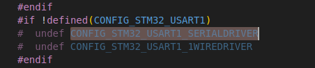

#       对于stm32来说，串口驱动全在公共驱动里面完成，只需要在menuconfig打开几个宏定义

##      bsp层  基本配置的deconfig文件中 以stm32f103-minimum：nsh为参考

###     CONFIG_STM32_USART1=y
1.  这是最重要的宏，这句宏的作用是总开关，直接告诉系统需要用串口1
2.  开启这个宏，会导致开启几个关键的宏  
####    CONFIG_STM32_USART1_SERIALDRIVER   定义于/home/kingadam/code/nuttxspace/nuttx/arch/arm/src/stm32/stm32_uart.h

1.  这个宏的开启会配置串口的参数 ，gpip引脚什么的都一起配置了
2.  里面比较复杂，就先不研究了

###     CONFIG_USART1_SERIAL_CONSOLE=y
    这个就是让串口1作为控制台
###     CONFIG_SERIAL_TERMIOS=y

##      库函数驱动层（由芯片厂商提供，不同于bsp，这个更为基础）  文件路径/home/kingadam/code/nuttxspace/nuttx/arch/arm/src/stm32/stm32_serial.c

###     1.一个串口的所有信息，引脚配置、buffer、函数等信息通过结构体进行集中管理 up_dev_s g_usart1priv ，然后通过结构体数组管理每一个串口
###     2.这个结构体是STM32串口驱动和底层硬件的“桥梁”，把设备初始化、IO 映射、中断、DMA、流控、RS-485、termios 全都装在一起，驱动内部靠它来管理每一个串口设备的所有状态和资源。

###     3.GPIO_USART1_TX 引脚定义于stm32f103c_pinmap_legacy.h和stm32f103c_pinmap.h  
1.  这是新旧两种方法，通过宏定义来适配
2.  在文件里面搜索  GPIO_USART1_TX 
###     4.函数解析
####    4.1 up_serialin 和 up_serialout

1.  这两个函数是hal层最底层的函数（寄存器访问接口）
2.  根据基地址和偏移地址去读取和设置寄存器值
####    4.2 up_setusartint()
1.  该函数就是用来通过寄存器设置串口中断的开启或关闭的。
2.  该函数还通过往上再一次包装，使用spin锁来保证线程安全。
3.  up_restoreusartint和up_disableusartint是再次包装，使用spin来保证线程安全

####    4.3 up_dma_nextrx()
####    4.4 up_set_format()
1.  配置串口的传输格式和波特率。它设置了多个串口的相关参数，包括波特率、数据位、停止位、校验位和硬件流控。具体来说，这个函数根据不同的硬件平台和配置选项来调整串口的工作参数。
####    4.5 up_setup（）
1.  串口驱动初始化函数，包括配置时钟、引脚、流控等
2.  up_set_apb_clock()配置apb的时钟，具体流程就不赘述没有必要

###     5.中断处理
###     5.1 up_attach()函数
1.  该函数并不直接开启中断，这里只是起一个类似于连接和注册的效果，中断的使能还是在up_rxint()和up_txint()函数中
2.  只是通过    irq_attach(priv->irq, up_interrupt, priv);  把将中断号（priv->irq）与中断处理函数（up_interrupt）关联起来。 
3.  如果中断连接成功（即 irq_attach 返回 OK），则调用 up_enable_irq 启用中断。这会允许中断发生并触发相应的中断服务例程。
###     5.2 up_interrupt（）函数
1.  函数原型    static int up_interrupt(int irq, void *context, void *arg)
2.  这是串口的公共中断函数，通过传进来的参数，来判断串口
3.  可以在里面编写针对不同串口的逻辑
4.  当然这个是非dma版的
###     5.3 up_receive()函数
1.  文件安里没有直接使用的，都是使用 uart_recvchars()函数，在内部有更好的封装和操作
2.  但其实 uart_recvchars() 函数也是调用 up_receive() 函数
3.  通过宏定义的方法调用了设备的接收函数
4.  #define uart_receive(dev,s)      dev->ops->receive(dev,s)
###     5.4 up_send()函数
1.  没啥好说的，就是按字节发送函数
###     5.5 up_ioctl()函数
1.      这个也没啥好说，不常会用

##      公共驱动层

