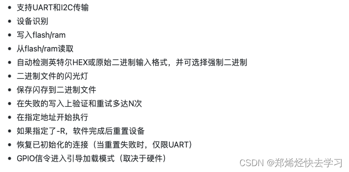

#       参考网址
https://blog.csdn.net/Alkaid2000/article/details/127620450

#       stm32flash安装
##      下载路径    https://github.com/ARMinARM/stm32flash
git clone https://github.com/ARMinARM/stm32flash.git
##      功能

##      下载后，在当前目录下进行编译：make -j4

##      若发生如上图错误，打开i2c.c文件中，加入这句： #define I2C_FUNC_I2C I2C_FUNCS

##      编译成功后，执行安装命令
###     sudo make install

#       使用方法
##      这个工具的用法可以输入./stm32flash -h进行查阅。
##      获取设备信息：  sudo stm32flash    /dev/ttyS0
##      使用如下命令烧录文件    sudo stm32flash -w nuttx.bin -v -g 0 /dev/ttyUSB0

